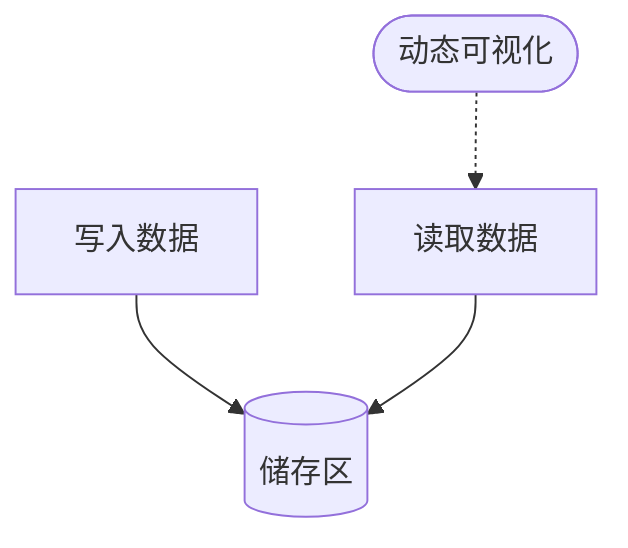
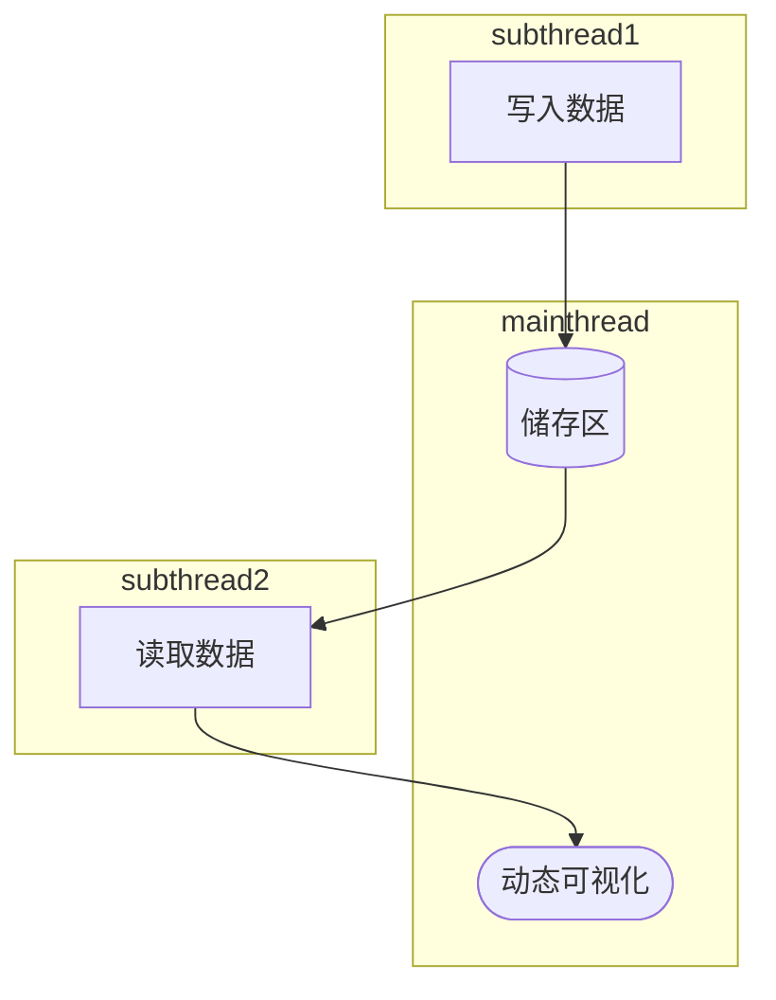
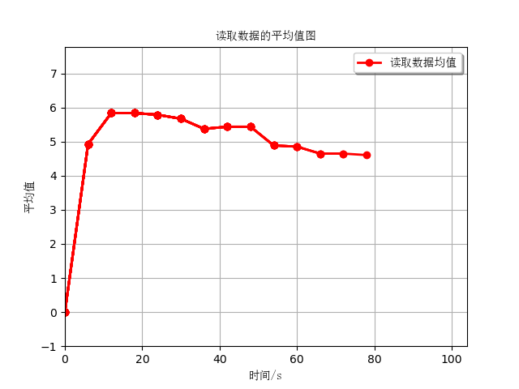

# <center>实验lab1
## 题目：
模拟流数据，编写程序，构建一个储存区（固定长度的向量）, 创建两个线程， 一个放数据（假定数据到达的时间服从泊松分布），一个读取存储数据（每多少秒读取一次），每次计算均值，画一个动态的图。
## 求解思路
1. 创建储存区
2. 写入数据线程
3. 读取数据线程
4. 主线程可视化
### 代码运行思路

<div style="display:none">

</div>



### 实现细节
- 储存区类：采用[固定长度列表实现的队列](Queue.py)为基础，增加队列满添加元素时，先出队腾出空间在入队的功能。
```python
class Store(object):
    # 初始化对象
    def __init__(self, init_len=20):
        self.len = init_len  # 储存区实例长度
        self.elems = np.array([np.nan] * self.len)  # 储存区实例存储空间
        self.head = 0  # 存储首元素下标
        self.num = 0  # 已存入元素量

    # 判断是否存满
    def is_full(self)
    # 判断存储区实例是否为空
    def is_empty(self)
    # 去除储存区首元素，若存储区空，则跳过
    def popstore(self)
    # 查看存储区首元素，若存储区空，返回nan
    def peek(self)
    # 向存储区尾部存入元素e，若存储区满，先去除首元素在存
    def enstore(self, e)
    # 查看并去除存储区首元素
    def destore(self)
    # 计算存储区非空元素的均值
    def nanmean(self)

```
- 写入数据函数：由```numpy.random```生成服从泊松的写入周期时间、服从正太分布的写入数据。
```python
from time import sleep
import numpy as np
# 写入向存储区元素
def write_data(store):
    # 不停写入
    while True:
        data_write = np.random.normal(5, 2, 1)  # 写入数据服从正态分布
        write_clock = int(np.random.poisson(6, 1))  # 写入间隔时间服从泊松分布
        store.enstore(data_write)  # 数据写入存储区
        sleep(write_clock)
```
- 读取数据函数：读取周期为```clock```，调用存储区类的```nanmean()```方法读取出存储区的平均值。
```python
# 读取储存区的均值
def read_data(store):
    # 定义全局变量，存放读取的数据，方便函数外调用
    global frame_data
    # 不停读取
    while True:
        frame_data = (read_time, store.nanmean())  # 读取的数据，第一项为读取的时间点，第二项为读取内容
        sleep(clock)
```
- 动态可视化：调用```matplotlib.animation```实现[动态图](animation.py)，更新周期为```clock```，更新数据为读取函数返回的```frame_data```。
```python
# 读取数据动态可视化
def visualize():
    # 初始画布设置
    fig, ax = plt.subplots()  # 定义画布
    ax.grid(True)  # 打开网格

    x, y = [0], [0]  # 初始点位绘制
    line, = ax.plot(x, y, 'ro-') # 注意line,为元组，要加逗号

    # 初始状态函数
    def init():
        return line,

    # 更新状态函数
    def update(frame):
        xdata, ydata = frame_data  # 对读取的数据拆包
        x.append(xdata)  # 更新绘制点
        y.append(ydata)

        line, = ax.plot(x, y, 'ro-')  # 绘制更新后的图
        return line,

    # 调用动态绘图函数并显示
    ani = animation.FuncAnimation(fig=fig, init_func=init, func=update, frames=1, interval=clock * 1000, blit=False)   # interval为更新图像时间间隔，单位ms
    plt.show()
```
## 结果：
