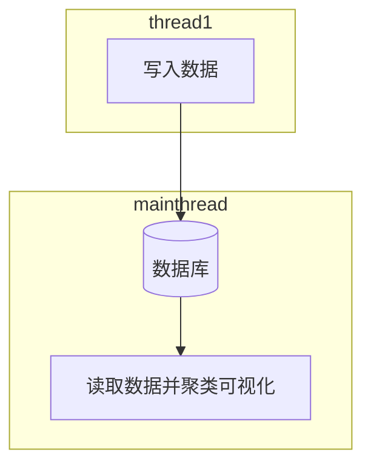
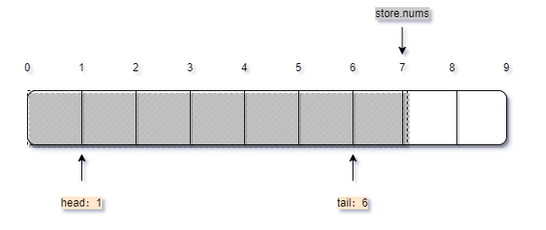
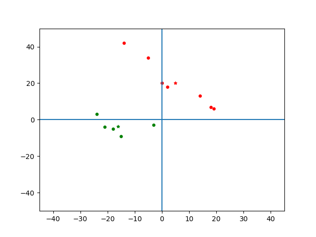

# <center>实验lab2
## 题目：
把原本生成的随机数变成二维的$ (x_1, x_2, \ldots,x_n) $且$F(X)$、$F(Xn)$具有明显的不同，采用滑动窗口的办法进行聚类，设计一个随机程序来控制所生成的随机数，发生概念漂移，对聚类结果进行比较。
## 求解思路
1. 聚类函数k-means
2. 储存区，采用较大的、固定的
3. 写入函数，每次写入随机两种明显不同的二维数据并发生概念漂移
4. 读取函数，使用滑动窗口模型读取并聚类可视化聚类效果
### 运行逻辑

### 实现细节
- 聚类函数：```k-means```聚类算法。
```python
# k-means聚类
def k_means(data_set, k):
    """
    k-means聚类实现
    :param data_set: 待聚类数据集。点集合，元素为n维数组表示坐标点
    :param k: 待聚类的集合数量
    :return: 聚类后的中心点和以下标键，聚类点集列表维值的字典
    """

    # 初始值
    data_dim = len(data_set[0])
    center_set = random.sample(data_set, k)

    # 定义欧式距离计算
    def euc_dis(x1, x2)

    # 以质心聚类
    def clustering(x_center_set, data_set)
        return cluster

    # 寻找质心
    def find_center(cluster)
        return finded_center_set

    # 迭代求解
    epsilon = delta = 0.1  # 迭代阈值epsilon
    while delta >= epsilon:
        old_center = center_set
        cluster = clustering(center_set, data_set)
        center_set = find_center(cluster)
        delta = euc_dis([0] * k, [euc_dis(x1, x2) for x1, x2 in zip(old_center, center_set)])

    # 返回结果
    return center_set, cluster
```

- 数据库类
```python
# 数据库类
class DataStore():
    def __init__(self, volum=50):
        self.volum = volum  # 存储容量
        self.elems = []  # 实例空间
        self.nums = 0  # 已存储元素量
        print("INFO: 成功创建数据库实例")

    def __isfull(self):
        '''判断是否满'''
        return self.nums == self.volum

    def enStore(self, ele):
        '''存入元素'''
        if self.__isfull():
            return
        self.elems.append(ele)
        self.nums += 1

    def deStore(self, start, end):
        '''读取元素'''
        if start < self.nums:
            return [self.elems[i] for i in range(start, min(self.nums, end))]
        else:
            return None
```
> ATTENTION ! 
> 1. 在最后```deStore()```中，首先判断切片开头下标是否合法，其次判断切片尾部是否过大。
> 2. 切边尾部比较细节： 最终切片尾部为给定位置与```store.nums```的较小值。
> 3. 元组列表不能直接使用列表切片！故使用列表推导式完成。

  写入：数据基本服从$y=-x+25$ 和 $y=-x-25$两条直线，少量概念漂移
```python
# 写入函数
def write_data(store):
    def Data1():
        '''符合特征1的二维数据'''
        dta1 = random.randrange(-25, 25)
        dta2 = -dta1 + 25 + random.randrange(-5, 5)
        return dta1, dta2

    def Data2():
        '''符合特征2的二维数据'''
        dta1 = random.randrange(-25, 25)
        dta2 = -dta1 - 25 + random.randrange(-5, 5)
        return dta1, dta2

    def Data3():
        '''符合特征3的二维数据，此处用作概念漂移'''
        dta1 = random.randrange(-25, 25)
        dta2 = dta1 + 1 + random.randrange(-10, 8)
        return dta1, dta2

    while True:
        k = random.choices((1, 2, 3), weights=[4, 4, 1], k=1)
        wdata = eval("Data{}()".format(k[0]))
        store.enStore(wdata)
        wait = np.random.poisson(3, 1)
        print("INFO: 写入{},{}数据成功，等待{}s继续写入！".format(k, wdata, wait[0]))
        sleep(wait[0])
```

- 读取并聚类可视化：
```python
# 读取及可视化函数
def read_data(store):

    def draw(ax, center, points):
        '''将聚类结果可视化，聚类中心用18号星号表示，聚类点用14号实心圆表示'''
        plt.xlim(-45, 45)
        plt.ylim(-50, 50)
        plt.axvline(0)
        plt.axhline(0)
        ax.scatter(center[0][0], center[0][1], s=18, c="r", marker='*')
        ax.scatter(center[1][0], center[1][1], s=18, c="g", marker='*')
        ax.scatter([x[0] for x in points[0]], [y[1] for y in points[0]], s=14, c="r", marker='o')
        ax.scatter([x[0] for x in points[1]], [y[1] for y in points[1]], s=14, c="g", marker='o')

    window = 12
    start = 0
    # global rdata
    while True:
        sleep(3)
        start += 1
        rdata = store.deStore(start, start + window)
        if rdata:
            print("INFO: 读取数据成功！为{}".format(rdata))
            poi, clus = k_means(rdata, 2)
            fig = plt.figure()
            ax = fig.add_subplot(1, 1, 1)
            draw(ax, poi, clus)
            plt.pause(2)
            print("INFO: 读取数据聚类并可视化成功！")
        else:
            print("INFO: 读取pass！")
            continue
```
> ATTENTION ! 
> 1. 读取数据聚类后，使用了```plt.figure()```和```plt.pause()```，它们只能在主线程使用。故该函数只能主线程执行。
> 2. ```plt.pause(2)```与```plt.show()```类似，但不会阻塞程序运行，执行2秒然后继续。
## 结果：
