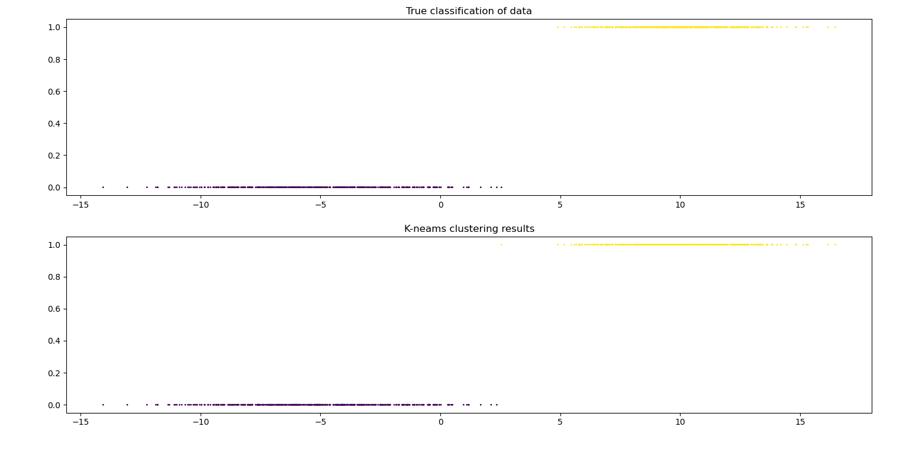

# <center>实验lab3
## 题目：
两个正态分布交替生成数据（并行生成数据，可以用01分布交替），做聚类，保证有两个族出现。
## 求解思路
1. 由题意定义生成数据函数
2. 聚类
3. 绘制数据的真实分类情况以及聚类得到的分类情况
### 实现细节
- 聚类函数：```k-means```聚类算法。[详见exam2](exam2#实现细节)
- 数据生成函数
```python
# 生成数据
def Generate():
    # 两种正态分布数据
    def Data1():
        return [random.normalvariate(-5, 3)]

    def Data2():
        return [random.normalvariate(10, 2)]

    # 交替生成数据
    generated_data = []
    clu_info = []
    for i in range(999):
        B = [0, 1]
        # 按照0-1分布交替生成两种数据
        if random.choice(B):
            generated_data.append(Data1())
            clu_info.append(0)
        else:
            generated_data.append(Data2())
            clu_info.append(1)

    return generated_data, clu_info
```
- 聚类并可视化
```python
 data, clu_info = Generate()
    # 聚类
    center, clus = K_means(data, 2)
    # clus_points_x = [x[0] for x in clus[0]]+([x[0] for x in clus[1]])  # 被聚类的点（1维）组成的集合
    i, j = 0, 1 if center[0] < center[1] else (1, 0)  # 靠右的分类点定义为0，使其与真实分类一致
    clus_points_y = [i]*len(clus[0]) + [j]*len(clus[1])  # 被聚类点对应的分类
    # 绘制聚类结果
    fig, axs = plt.subplots(2, 1)
    fig.tight_layout()  # 调整子图间距
    axs[0].scatter(data, clu_info, s=1, c=clu_info)
    axs[0].set_title("True classification of data")
    axs[1].scatter(clus[0]+clus[1], clus_points_y, s=1, c=clus_points_y)
    axs[1].set_title("K-neams clustering results")
    plt.show()
```
## 结果
