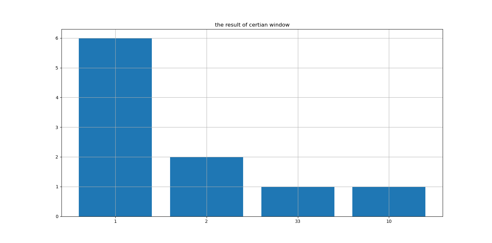

# 
实验lab4
## 题目：
小型网购平台售卖50种商品（编号1~50），到当前时间点共交易了100笔订单（编号1~100），假设第k笔订单的交易商品集合为 $ \{i|k \mod i=0\} $。例如：第18笔订单交易商品集合为$\{1,2,3,6,9,18\}$。

1. 在界标窗口模型下，若支持度阈值为10，列出所有频繁项集。
2. 在滑动窗口模型下，若窗口长度为50，相对支持度阈值为0.12，列出当前窗口所有的频繁项集。

使用黏性抽样算法。

## 结果
